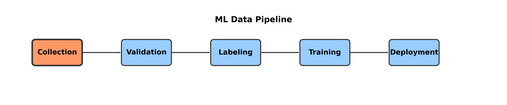
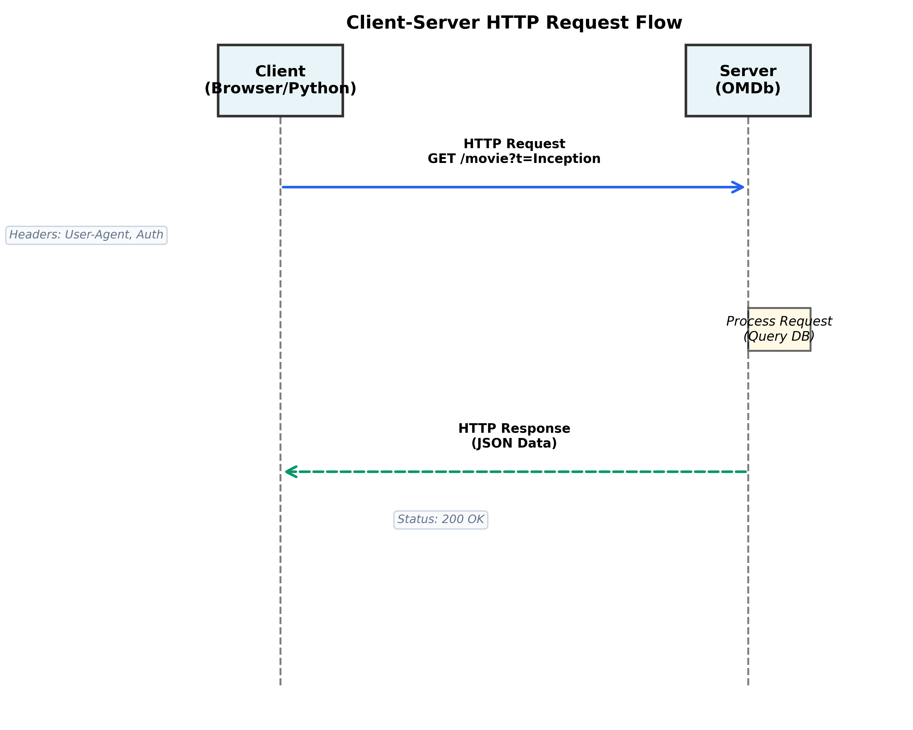
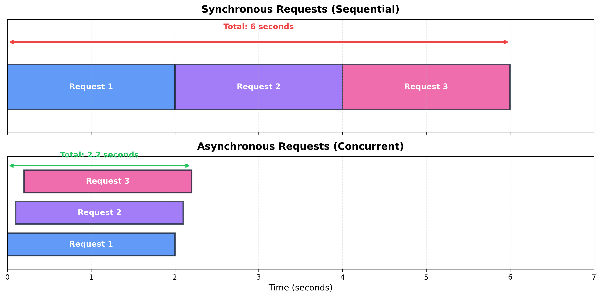

<!-- _class: lead -->

# Week 1: Data Collection for Machine Learning

**CS 203: Software Tools and Techniques for AI**

Prof. Nipun Batra
IIT Gandhinagar

---

# The Netflix Movie Recommendation Problem

**Scenario**: You work at Netflix as a data scientist.

**The Task**: "Predict which movies will be successful to decide our next acquisitions."

**The Bottleneck**: We have no data.

**Today's Focus**: How do we build the dataset to solve this problem?

---

# The ML Pipeline


*[diagram-generators/data_pipeline_flow.py](../diagram-generators/data_pipeline_flow.py)*

**Garbage In, Garbage Out**:
- 80% of ML work is data engineering.
- Sophisticated models cannot fix broken data.
- **Goal**: Automate the collection of high-quality data.

---

# Data Sources Strategy

We need features: *Title, Budget, Revenue, Reviews, Cast*.

| Source Type | Example | Pros | Cons |
| :--- | :--- | :--- | :--- |
| **Public APIs** | OMDb, TMDb | Structured, Reliable | Rate limits, Cost |
| **Web Scraping** | IMDb, Rotten Tomatoes | Free, Flexible | Fragile, IP bans |
| **Datasets** | Kaggle, Hugging Face | Clean, Ready | Static, Generic |

**Plan**: Use OMDb API for base data + Scraping for reviews.

---

# Part 1: The Web Protocol (HTTP)

How browsers (and scripts) talk to servers.

---

# Client-Server Architecture


*[diagram-generators/http_request_sequence.py](../diagram-generators/http_request_sequence.py)*

---

# Anatomy of a Request

**URL**: `https://api.omdbapi.com/?apikey=123&t=Inception`

**Methods**:
- `GET`: Retrieve data (Read). *Safe, Idempotent.*
- `POST`: Send data (Write). *Creating resources.*
- `PUT`: Update data.
- `DELETE`: Remove data.

**Status Codes**:
- `200`: OK.
- `400`: Bad Request (Client error).
- `401/403`: Unauthorized (Check your API Key).
- `429`: Too Many Requests (Rate limited).
- `500`: Internal Server Error.

---

# Part 2: CLI Tools (curl & jq)

Test APIs before writing code.

---

# curl: The HTTP Swiss Army Knife

**Fetch data**:
```bash
curl "http://www.omdbapi.com/?apikey=$KEY&t=Inception"
```

**Inspect headers (`-I`)**:
```bash
curl -I "https://google.com"
# HTTP/2 200
# content-type: text/html
```

**Why use curl?**
- Language agnostic.
- Instant debugging.
- "Copy as curl" from Chrome DevTools.

---

# jq: JSON Processor

Raw JSON is unreadable. `jq` makes it useful.

**Pretty print**:
```bash
curl ... | jq
```

**Filter fields**:
```bash
# Get just the title and rating
curl ... | jq '{Title, imdbRating}'
```

**Filter array elements**:
```bash
# Get titles of movies created after 2010
cat movies.json | jq '.[] | select(.Year > 2010) | .Title'
```

---

# Part 3: Python `requests`

Automating the process.

---

# The Synchronous Pattern

`requests` is **blocking**. The program stops until the server responds.

```python
import requests

def get_movie(title):
    url = "http://www.omdbapi.com/"
    params = {"apikey": "SECRET", "t": title}
    
    try:
        # Block here until response arrives
        resp = requests.get(url, params=params)
        resp.raise_for_status() # Check for 4xx/5xx
        return resp.json()
    except Exception as e:
        print(f"Failed: {e}")
        return None
```

---

# Advanced: Async IO (Conceptual)

**Problem**: Fetching 1,000 movies sequentially is slow.
**Solution**: Asynchronous Requests (`aiohttp`, `httpx`).


*[diagram-generators/sync_vs_async_timing.py](../diagram-generators/sync_vs_async_timing.py)*

*We will implement Async in Week 10 (FastAPI).*

---

# Handling Rate Limits

**Exponential Backoff**: If failed, wait longer.

```python
import time

def fetch_with_retry(url, retries=3):
    for i in range(retries):
        resp = requests.get(url)
        if resp.status_code == 429: # Rate limit
            wait = 2 ** i  # 1s, 2s, 4s...
            time.sleep(wait)
            continue
        return resp
```

**Ethical Scraping**:
- Always check `robots.txt` (e.g., `imdb.com/robots.txt`).
- Identify your bot (`User-Agent: MyStudentBot/1.0`).
- Limit request rate (1 request/sec).

---

# Part 4: Web Scraping (BeautifulSoup)

When there is no API.

---

# The DOM Tree

HTML is a tree of tags. `BeautifulSoup` traverses it.

```html
<div class="movie-card">
    <h1>Inception</h1>
    <span class="rating">8.8</span>
</div>
```

**Parsing Logic**:
1. Find container: `div.movie-card`
2. Extract children: `h1` (text), `span.rating` (text).

---

# Scraping Strategies

| Strategy | Library | Use Case |
| :--- | :--- | :--- |
| **Static HTML** | `BeautifulSoup` | Simple sites, fast, lightweight. |
| **Dynamic JS** | `Playwright` | Single Page Apps (React/Vue), infinite scroll. |
| **Visual** | `GPT-4V` | Complex layouts, CAPTCHAs (expensive). |

*Note: Playwright is covered in the Lab.*

---

# Data Licensing & Ethics

**Can I use this data?**

1.  **Public Domain (CC0)**: Free to use.
2.  **Attribution (CC-BY)**: Use, but credit source.
3.  **Non-Commercial (NC)**: Academic use OK, selling NOT OK.
4.  **Copyright**: "All Rights Reserved".
    - *Fair Use*: Small excerpts for research *might* be okay.
    - *Scraping*: Generally legal for public data (US hiQ v LinkedIn), but ToS violation can get you banned.

**Rule**: Be respectful. Don't DDoS the server.

---

# Summary

1.  **APIs > Scraping**: Always look for an API first (stable, legal).
2.  **Tools**: `curl` for quick checks, `requests` for scripts.
3.  **Robustness**: Handle errors, retries, and rate limits.
4.  **Ethics**: Respect `robots.txt` and server load.

**Next Up**: Now that we have data, it's probably messy. **Week 2: Data Validation**.
